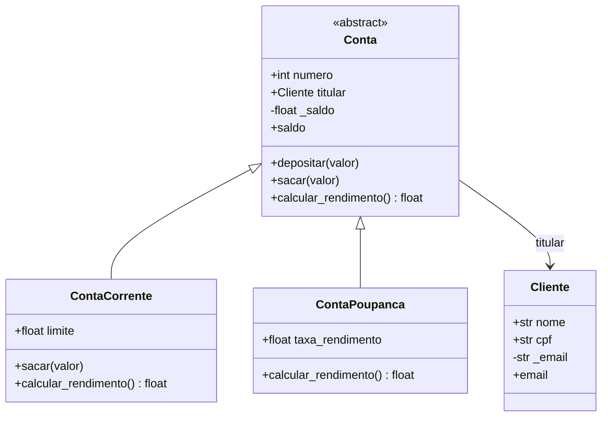

# Entrega 6 — Programação Orientada a Objetos (Sistema Bancário)

Sistema bancário simples que modela clientes e contas usando classes,
herança, classes abstratas, encapsulamento com `@property` e polimorfismo.

## Diagrama de classes



## Decisões de modelagem

- **Herança (`Conta → ContaCorrente, ContaPoupanca`)**: escolhida porque a
  relação é "é um" — uma conta corrente *é uma* conta, só muda como ela
  calcula rendimento e até onde pode ficar negativa. Isso evita duplicar
  `depositar`, `__str__`, `__eq__` e `__lt__`, que são iguais nas duas.
- **`Conta` como classe abstrata (`ABC` + `@abstractmethod`)**: não faz
  sentido existir uma "conta genérica" sem saber como ela rende — por isso
  `calcular_rendimento()` é obrigatório nas subclasses e `Conta()` não pode
  ser instanciada diretamente.
- **Composição (`Conta` tem um `Cliente`)**: o cliente não "é uma" conta,
  então em vez de herança a conta apenas guarda uma referência ao titular.
- **`@property` em `saldo`**: tanto `Conta` quanto `ContaCorrente` validam o
  valor no setter (saldo não pode ficar negativo na poupança, e não pode
  passar do limite do cheque especial na conta corrente), garantindo que o
  objeto nunca fique em um estado inválido.
- **`@property` em `Cliente.email`**: valida o formato com regex no setter,
  recusando e-mails malformados já na criação do cliente.

## Polimorfismo

`calcular_rendimento()` é chamado da mesma forma para qualquer conta da
lista, mas cada subclasse responde diferente: `ContaCorrente` sempre
devolve `0.0` (não rende), `ContaPoupanca` devolve `saldo * taxa_rendimento`.

## Exemplo de uso

```python
conta = ContaPoupanca(2001, cliente, saldo_inicial=3000.0, taxa_rendimento=0.006)
conta.depositar(100)
print(conta.calcular_rendimento())  # 18.6
```

## Como executar

```bash
python sistema_bancario.py
```

O script cria 10 instâncias (4 clientes, 10 contas), imprime o extrato de
todas, demonstra o polimorfismo no cálculo de rendimento, testa exceções
(`SaldoInsuficienteError` ao sacar mais do que saldo + limite, `ValueError`
ao cadastrar e-mail inválido) e compara contas com `__eq__`/`__lt__`.
