# techX — Banco digital mobile

> Protótipo de front-end de um aplicativo de banco digital brasileiro: saldo, extrato com filtros, Pix de ponta a ponta com comprovante, cartões e notificações.

<p>
  
  
  
  
</p>

Este repositório nasceu de um wireframe gerado no **Figma Make**. O arquivo original
tinha 5 telas dentro de um único `App.tsx`, sem rotas, sem tipos, sem estados de
carregamento e usando emojis no lugar de ícones. Aqui ele foi auditado, reescrito e
estendido para **13 telas** com fluxo real, acessibilidade e um design system
documentado. O detalhe do que mudou está em
[O que mudou em relação ao Figma Make](#o-que-mudou-em-relação-ao-figma-make).

---

## Telas

Capturas reais do app rodando, em 390 × 844 @2x, geradas por script
(`npm run screens`) — não são mockups.

### Entrada e visão geral

| Login | Início | Extrato |
|:--:|:--:|:--:|
| 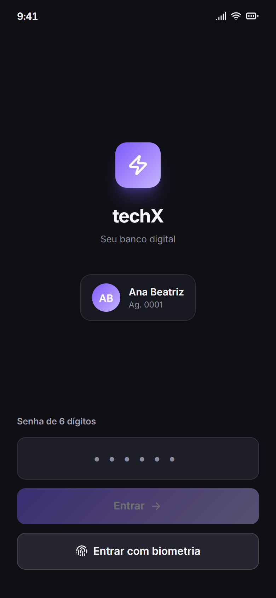 | 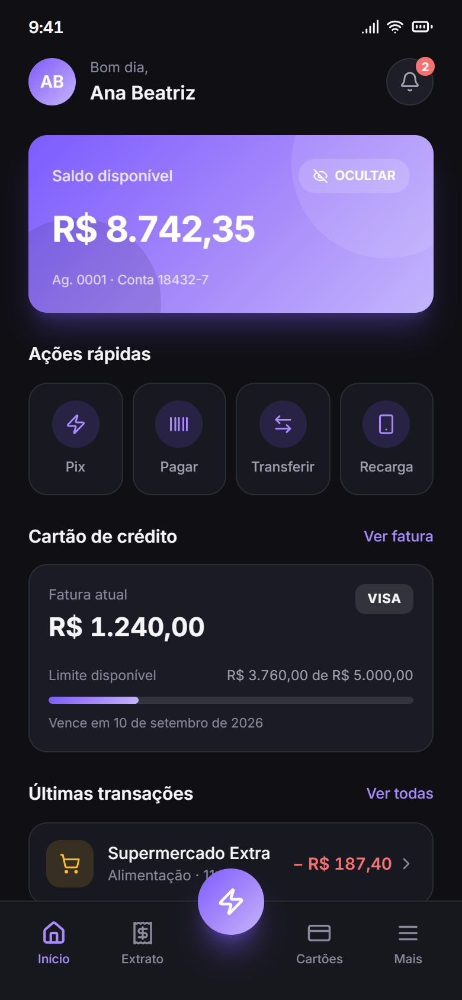 | 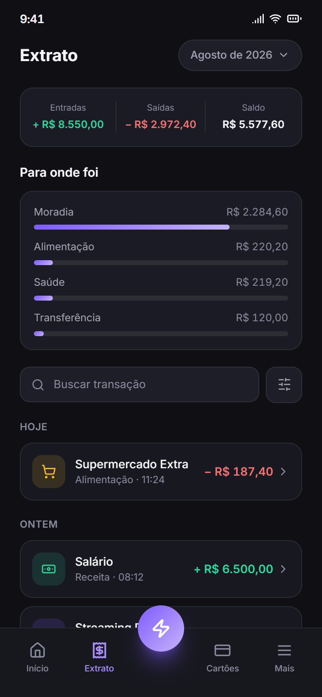 |
| Sessão com senha numérica ou biometria. Estado de carregamento no botão. | Saldo ocultável, 4 ações rápidas, resumo da fatura com barra de limite e as últimas transações. | Resumo de entradas/saídas/saldo calculado, gastos por categoria, busca e filtros. |

### Transação e Pix

| Detalhe da transação | Hub do Pix | Passo 1 — Destino |
|:--:|:--:|:--:|
| 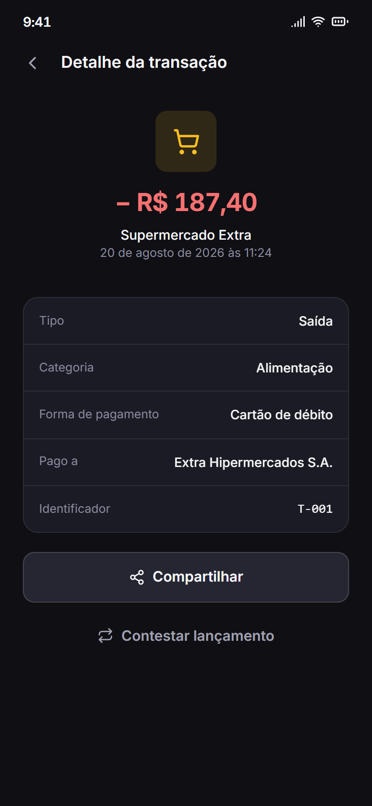 | 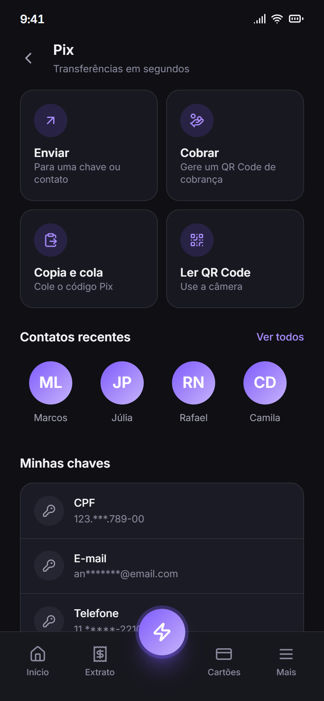 | 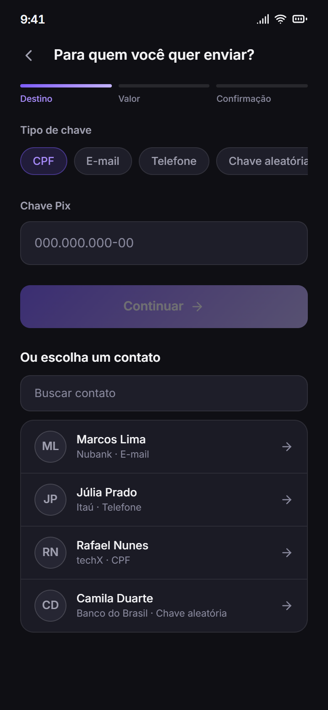 |
| Ficha completa do lançamento, com atalho para o comprovante e contestação. | Quatro caminhos do Pix, contatos recentes e as chaves da conta. | Seletor de tipo de chave com validação de formato por tipo, mais busca de contatos. |

| Passo 2 — Valor | Passo 3 — Confirmação | Sucesso |
|:--:|:--:|:--:|
| 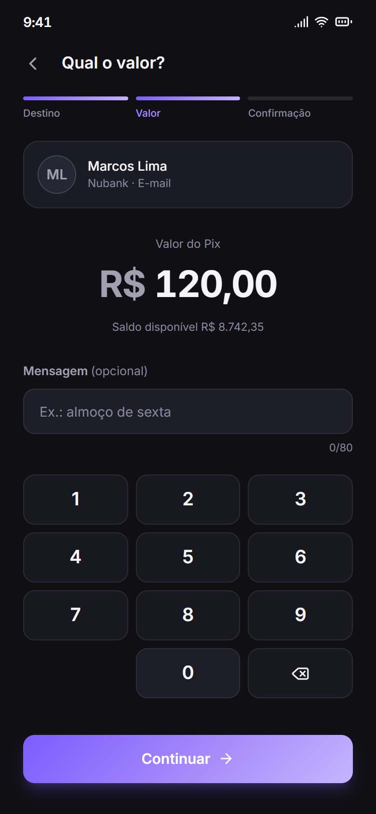 | 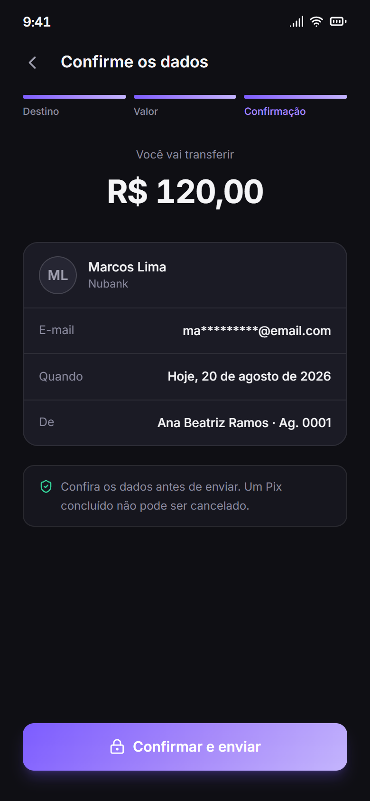 | 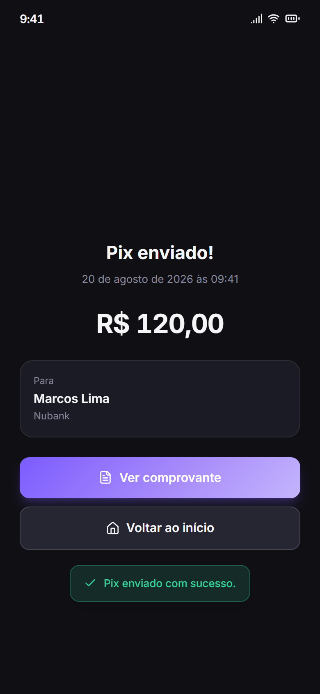 |
| Teclado próprio, validação contra saldo e limite, mensagem opcional com contador. | Chave mascarada para conferência e aviso de que o Pix é irreversível. | Confirmação com animação que respeita `prefers-reduced-motion`. |

| Comprovante | Cartões | Notificações | Mais |
|:--:|:--:|:--:|:--:|
| 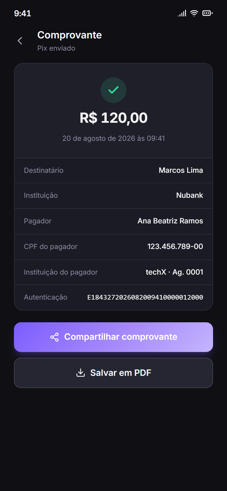 | 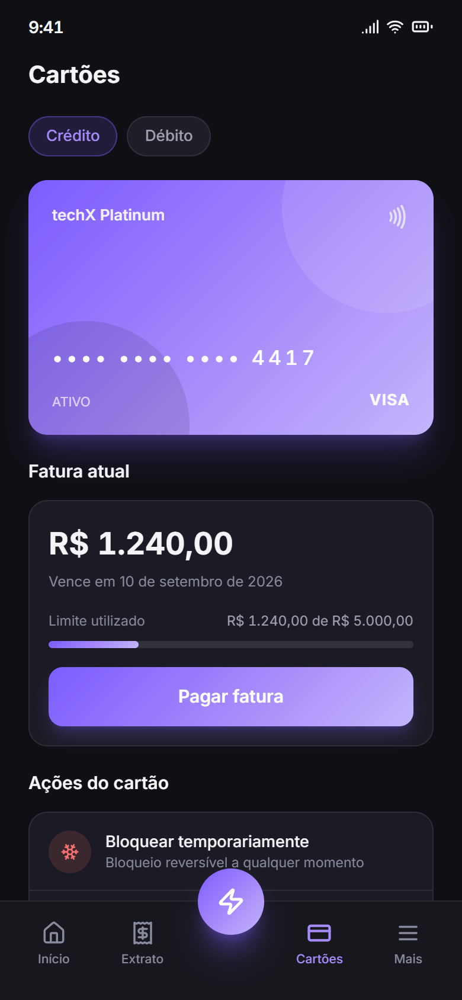 | 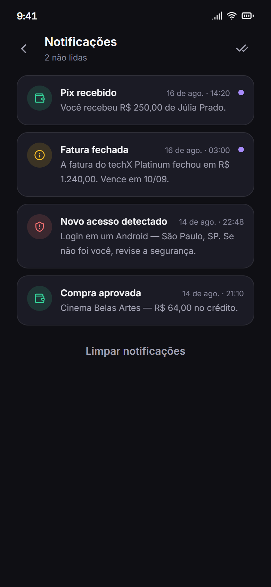 | 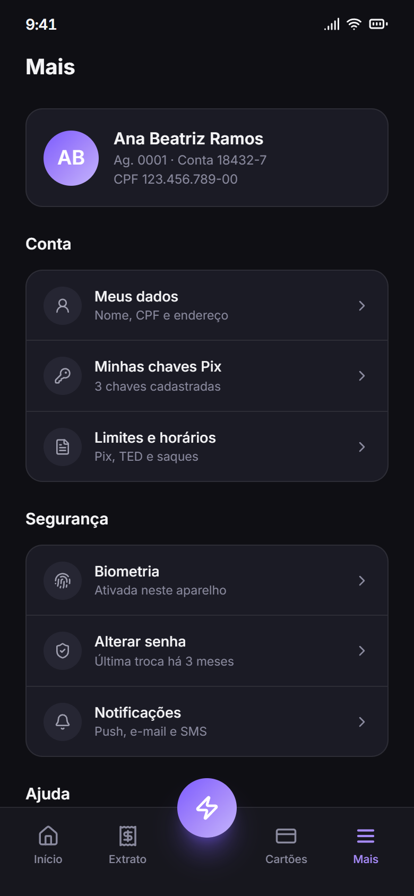 |
| Documento com autenticação, compartilhar e salvar em PDF. | Alterna crédito/débito, bloqueio reversível, limite e cartão virtual. | Marcar tudo como lido e limpar, com estado vazio próprio. | Perfil, grupos de configuração e saída da conta. |

---

## Mapa de navegação

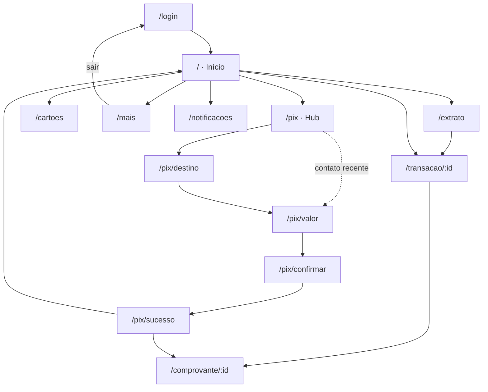

As quatro abas fixas (Início, Extrato, Cartões, Mais) e o botão flutuante do Pix
ficam na navegação inferior. As telas de fluxo — login, passos do Pix, comprovante,
detalhe e notificações — abrem sem a barra, como telas empilhadas.

---

## O que mudou em relação ao Figma Make

O arquivo original passou por 4 versões: começou como wireframe cinza de 3 telas e
terminou, no prompt *"melhore, deixe mais bonito e colorido"*, como um app dark +
roxo. A direção visual da v4 foi mantida; o que estava por baixo dela, não.

| # | Como estava no Figma Make | Como ficou |
|---|---|---|
| 1 | Tudo em um `App.tsx` + `index.css`, sem componentes | 13 telas, 12 componentes reutilizáveis, seletores e hooks separados |
| 2 | Navegação por `useState` interno | Rotas reais (`react-router-dom`), com deep link e botão voltar |
| 3 | Emojis como ícones (🍔, 💳…) | `lucide-react`, com cor herdada do tema e `aria-label` por categoria |
| 4 | `"R$ 1.240,00"` e `"Hoje"` escritos à mão | `Intl.NumberFormat`/`DateTimeFormat` pt-BR; valores em centavos |
| 5 | Totais do extrato eram números fixos | Somas, agrupamento por dia e gastos por categoria calculados de verdade |
| 6 | Nenhum estado de carregamento, vazio ou erro | Skeletons, estado vazio, estado de erro com "tentar de novo" |
| 7 | Pix aceitava qualquer coisa e não validava nada | Validação por tipo de chave, valor > 0, saldo e limite por operação |
| 8 | Fluxo terminava na tela de sucesso | Comprovante com autenticação, compartilhar e salvar em PDF |
| 9 | Sem foco visível, sem landmarks, sem `aria-*` | Foco visível, `<nav>`/`<main>`/`<header>`, `aria-current`, `aria-pressed`, `role="progressbar"` |
| 10 | Contraste do texto secundário não verificado | Paleta de texto verificada em WCAG AA (mínimo 4.9:1 sobre todas as superfícies) |
| 11 | Animações sempre ativas | `prefers-reduced-motion` respeitado globalmente |
| 12 | Travado em 390 × 844 | Mobile-first: ocupa a tela no celular, vira frame centralizado no desktop |
| 13 | "Ocultar saldo" voltava ao padrão a cada reload | Preferência persistida em `localStorage` |

### Telas que não existiam

Login, detalhe da transação, hub do Pix (cobrar / copia e cola / QR Code / minhas
chaves), comprovante e notificações.

---

## Design system

Os tokens vivem em [`src/index.css`](src/index.css) como variáveis CSS expostas ao
Tailwind via `@theme`, então `bg-surface-2` ou `text-dim` saem direto do token.

| Papel | Token | Valor |
|---|---|---|
| Fundo | `--color-bg` | `#0F0F14` |
| Superfície | `--color-surface` / `--color-surface-2` / `--color-surface-3` | `#17171F` · `#1E1E29` · `#262633` |
| Texto | `--color-ink` / `--color-dim` / `--color-muted` | `#F5F5F7` · `#A0A0B0` · `#8A8A9E` |
| Marca | `--color-brand` → `--color-brand-2` | `#7C5CFF` → `#A78BFA` |
| Positivo | `--color-success` | `#34D399` |
| Negativo | `--color-danger` | `#F87171` |
| Alerta | `--color-warn` | `#FBBF24` |

**Contraste.** Todos os tons de texto foram verificados sobre as três superfícies.
O pior caso é `--color-muted` sobre `--color-surface-2`, em **4.9:1** — acima do
mínimo de 4.5:1 exigido pela WCAG AA para texto normal.

**Tipografia.** Inter (400/500/600/700), herdada do briefing original. Valores
monetários usam `font-variant-numeric: tabular-nums` para alinhar em coluna.

**Espaçamento.** Escala múltipla de 8, também do briefing original. Margem lateral
de 24px em todas as telas.

---

## Stack

- **React 18** + **TypeScript 5.7** em modo `strict`
- **Vite 6** para build e preview
- **Tailwind CSS 4** com tokens via `@theme`
- **react-router-dom 6** — `HashRouter`, para publicar como site estático
- **lucide-react** — ícones
- **puppeteer-core** — captura das telas usando o Chrome já instalado

### Estrutura

```
src/
├─ App.tsx                 rotas
├─ index.css               tokens do design system
├─ types/index.ts          Transaction, Account, CreditCard, Contact, PixKey…
├─ data/mock.ts            fonte única dos dados de demonstração
├─ lib/
│  ├─ format.ts            Intl pt-BR: dinheiro, datas, máscara de chave Pix
│  ├─ selectors.ts         agrupamento, filtros, somas, gastos por categoria
│  ├─ PixFlow.tsx          máquina de estado do Pix + validações
│  ├─ useAsyncData.ts      ciclo loading → ready/error
│  └─ useLocalStorage.ts   preferências persistidas
├─ components/             Layout, BottomNav, Sheet, Toast, TxRow, Money…
└─ screens/                uma por tela
scripts/screenshots.mjs    gera docs/screens/*.png
docs/screens/              as 13 capturas usadas neste README
specs/                     arquitetura, capacidades e estratégia de testes
```

---

## Como rodar

```bash
npm install
```

```bash
npm run dev
```

Abre em `http://localhost:5173`. Para ver como celular, use o modo dispositivo do
navegador em 390 × 844 — acima de 768px o app se desenha como um frame centralizado.

| Script | O que faz |
|---|---|
| `npm run dev` | Servidor de desenvolvimento |
| `npm run build` | Checagem de tipos (`tsc -b`) + build de produção |
| `npm run preview` | Serve o `dist/` em `http://localhost:4173` |
| `npm run screens` | Regera `docs/screens/*.png` (exige `npm run build` antes) |
| `npm run lint` | Só a checagem de tipos |

---

## Limites deste protótipo

Vale dizer o que **não** está aqui, para ninguém se surpreender:

- **Não há backend.** Tudo vem de [`src/data/mock.ts`](src/data/mock.ts); nenhuma
  requisição de rede é feita e nada é persistido além da preferência de ocultar o saldo.
- **Não há autenticação real.** A tela de login aceita qualquer senha de 6 dígitos.
- **Pagar, Transferir, Recarga, cobrar por Pix e ler QR Code** abrem um aviso
  explicando que não fazem parte do protótipo. O fluxo completo é o do **Pix enviar**.
- Ações como "salvar em PDF" e "compartilhar" mostram confirmação visual, mas não
  produzem arquivo.
- A data de referência é fixa (`2026-08-20`) para manter "Hoje"/"Ontem" estáveis e
  os screenshots reprodutíveis.

## Próximos passos

- [ ] Trocar `src/data/mock.ts` por uma API real, mantendo os tipos de `src/types`
- [ ] Autenticação de verdade, com sessão e refresh de token
- [ ] Implementar Pix cobrar, copia e cola e leitura de QR Code
- [ ] Testes: unitários nos seletores/formatadores e end-to-end no fluxo do Pix
- [ ] Tema claro, reaproveitando os tokens já isolados
- [ ] Publicar no GitHub Pages a partir do `dist/`

---

<sub>Projeto acadêmico. Nomes, valores, instituições e transações são fictícios.</sub>
